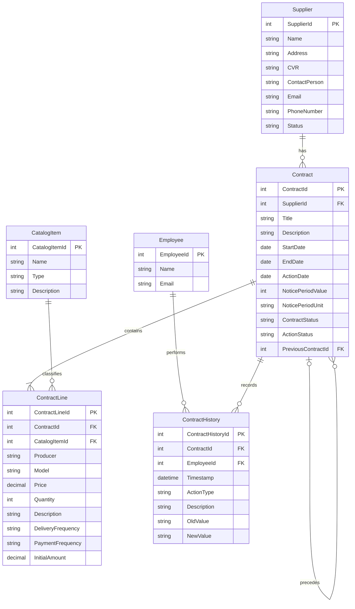

```mermaid
erDiagram
    Supplier ||--o{ Contract : has
    Contract o|--o{ Contract : precedes
    Contract ||--|{ ContractLine : contains
    CatalogItem ||--o{ ContractLine : classifies
    Employee ||--o{ ContractHistory : performs
    Contract ||--o{ ContractHistory : records

    Supplier {
        int SupplierId PK
        string Name
        string Address
        string CVR
        string ContactPerson
        string Email
        string PhoneNumber
        string Status
    }

    Contract {
        int ContractId PK
        int SupplierId FK
        string Title
        string Description
        date StartDate
        date EndDate
        date ActionDate
        int NoticePeriodValue
        string NoticePeriodUnit
        string ContractStatus
        string ActionStatus
        int PreviousContractId FK
    }

    ContractLine {
        int ContractLineId PK
        int ContractId FK
        int CatalogItemId FK
        string Producer
        string Model
        decimal Price
        int Quantity
        string Description
        string DeliveryFrequency
        string PaymentFrequency
        decimal InitialAmount
    }

    CatalogItem {
        int CatalogItemId PK
        string Name
        string Type
        string Description
    }

    Employee {
        int EmployeeId PK
        string Name
        string Email
    }

    ContractHistory {
        int ContractHistoryId PK
        int ContractId FK
        int EmployeeId FK
        datetime Timestamp
        string ActionType
        string Description
        string OldValue
        string NewValue
    }
```